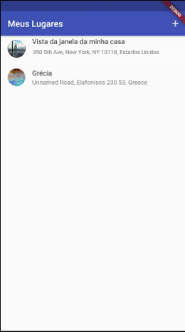

# App de Lugares

# Escopo e objetivo

O projeto é a codificação de um aplicativo de lugares com utilização de recursos nativos como Câmera e Mapas.

### O app contempla:
- Providers;
- Acesso a câmera Android/IOS;
- Acesso a localização do dispositivo;
- Utilização do pacote sqflite para gerir os dados;
- Configuração e utilização das APIs do Google Maps;
- Permissões no Android: AndroidManifest.xml;
- Permissões no IOS: Info.plist e AppDelegate.swift
- Reverse geocoding para pegar informações a partir de uma posição no mapa;
- Armazenamento de dados no SQLite.

### Iniciando...

- `git clone https://github.com/rayssasandrade/great_places.git`
- `cd shop`
- `flutter run`

### Resultado

- Execução do algoritmo 
  

### Autor

<a href="#">
 
 
<b>Rayssa Andrade</b></a>

Feito com ❤️ por Rayssa Andrade 👋🏽 Entre em contato!

